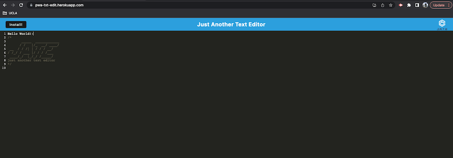
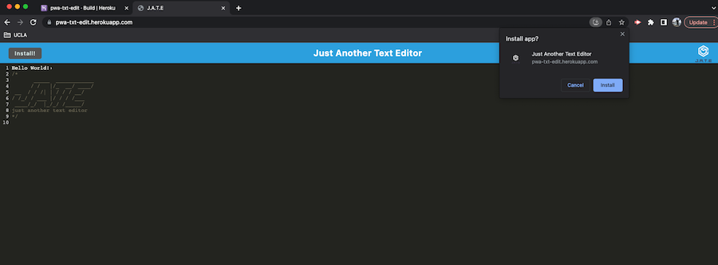
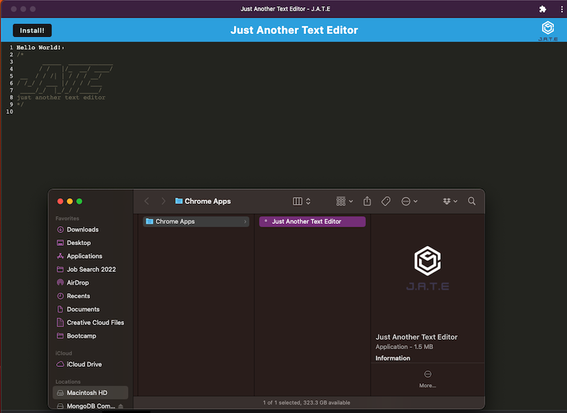

#  Challenge Nineteen - Just Another Text Editor 

  
        
  ## Description
   This week's assignment was to take an already existing text editor application, and add code to make it run both in the browser and offline. This is beneficial for if you don't have an internet connection, or a browser that doesn't support it. 
   
   In this assignment, I used Webpack, idb, express, concurrently, babel, and workbox. The code is written in JavaScript.
  
  ## Table of Contents
  - [Usage](#usage)
  - [Link](#link)
  - [License](#license)
  
  ## Usage
  This application could be used for anyone wanting to write their own code for a website or application, whether they have an internet connection or not.

  ## Link
  You can access the application at https://pwa-txt-edit.herokuapp.com/. NOTE: App is no longer active as of 1/9/2024  
  
  
  Click the "Install" button at the top to install the application onto your local machine. 
  
  
  
  ## License
      This project is covered under the ISC license. To learn more, click the badge at the top.

  ## Questions
  If you have any questions, reach out to me at https://github.com/carlihudson, or shoot me an email at carlihudson@gmail.com.
   
